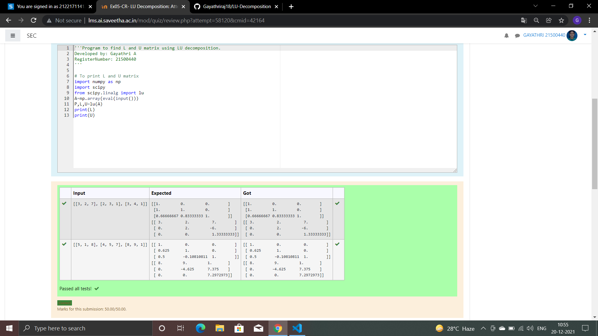
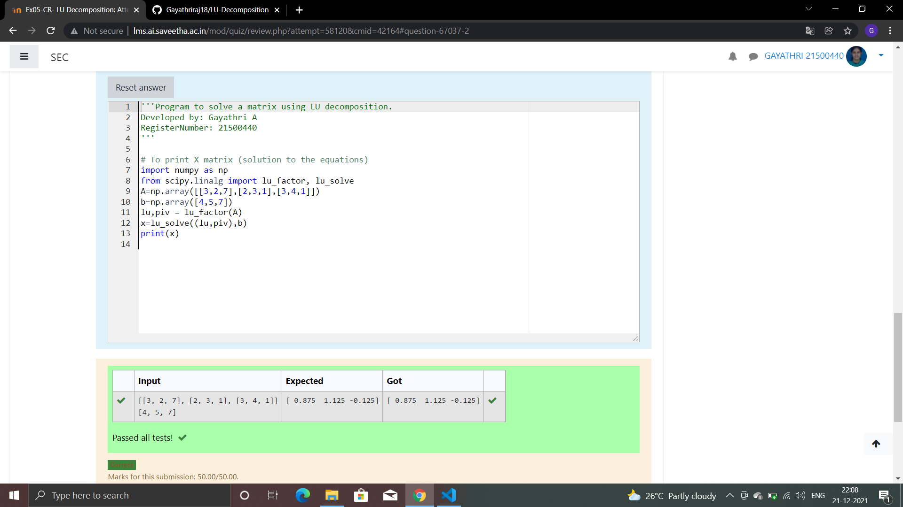

# LU Decomposition without zero on the diagonal

## AIM:
To write a program to find the LU Decomposition of a matrix.

## Equipments Required:
1. Hardware – PCs
2. Anaconda – Python 3.7 Installation / Moodle-Code Runner

## Algorithm
1. 
Import numoy package
2. 
From scipy package import lu
3. 
Get input from the user
4. 
Print result
## Program:
```PYTHON
'''Program to find L and U matrix using LU decomposition.
Developed by: Gayathri A
RegisterNumber: 21500440
'''

# To print L and U matrix
import numpy as np
import scipy
from scipy.linalg import lu
A=np.array(eval(input()))
P,L,U=lu(A)
print(L)
print(U)
```
```python
# To print X matrix (solution to the equations)
import numpy as np
from scipy.linalg import lu_factor, lu_solve
A=np.array([[3,2,7],[2,3,1],[3,4,1]])
b=np.array([4,5,7])
lu,piv = lu_factor(A)
x=lu_solve((lu,piv),b)
print(x)
```


## Output:



## Result:
Thus the program to find the LU Decomposition of a matrix is written and verified using python programming.

